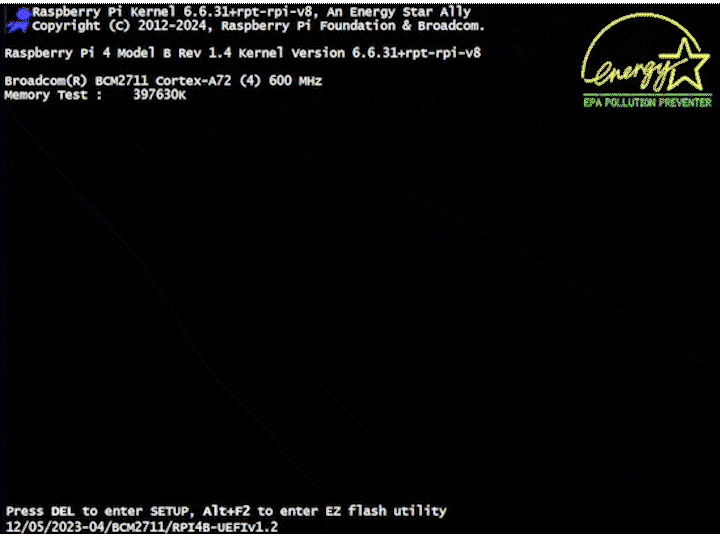

<!-- markdownlint-configure-file {
  "MD033": false,
  "MD041": false
} -->
<div align="center">

# RSPI BIOS

[Raspberry Pi][raspberry] dashboard that mimics the style of old [BIOS][bios] designs.



</div>

## Features

<!-- TODO: Add more features and packages/crates -->

- [x] Served by a Rust-powered web server
  - *...using the [axum] crate*
- [x] Displays real system data from the Raspberry Pi
  - *...using the [sysinfo] crate*
- [x] Implements [Server-Sent Events (SSE)][sse] for real-time updates
  - *...using the axum and [tokio] crates*
- [x] Uses templating for HTML generation
  - *...using the [askama] crate*
- [x] Mimics old [BIOS](bios) designs
  - *...using the [TuiCss][tuicss] package*
- [x] Served over HTTPS
  - *...preferably using [Cloudflare Tunnels][tunnel] and an [Origin CA cert][origin]*

## Usage

### Cross-compile for Raspberry Pi

```bash
# Install dependencies (Ubuntu 24.04 LTS)
# You may need some or all of these
# See https://aws.github.io/aws-lc-rs/requirements/linux.html
sudo apt-get install -y build-essential clang libclang1 cmake gcc-arm-linux-gnueabihf
cargo install --force --locked bindgen-cli

# Add target (linker already configured for you in ./.cargo/config.toml)
rustup target add armv7-unknown-linux-gnueabihf

# Build
cargo build --release --target=armv7-unknown-linux-gnueabihf
```

You can then copy and run the outputted binary like this:

```bash
# Copy
ssh piotrpdev@192.168.0.200 "mkdir -p ~/rspi-bios" && \
scp -r target/armv7-unknown-linux-gnueabihf/release/rspi-bios templates/ certs/ \
  piotrpdev@192.168.0.200:~/rspi-bios/

# Run
ssh -t piotrpdev@192.168.0.200 "chmod +x ~/rspi-bios/rspi-bios && ~/rspi-bios/rspi-bios"
```

If you want, you can bind to a low port like this:

```bash
# (Optional) Allow rspi-bios to bind low ports without root
# https://stackoverflow.com/a/414258/19020549
sudo setcap CAP_NET_BIND_SERVICE=+eip ./rspi-bios

# Run on low port
./rspi-bios 443
```

A template [`rspi-bios.service`][service] file is also included in the repo if you're
using `systemd` and want to automatically run the script on startup e.g.:

```bash
# Edit the template
vim ./rspi-bios.service

# Copy it
sudo cp ./rspi-bios.service /lib/systemd/system/

# Start on boot (--now to start now)
sudo systemctl enable rspi-bios.service
```

### Development

```bash
cargo install cargo-watch
cargo-watch --watch src --watch templates -x run
```

## License

This project is licensed under the [GNU GPL v3.0][license].

Made using the following resources:

| Resource                                  | License                           |
|:-----------------------------------------:|:---------------------------------:|
| [Axum example code][axum-examples]        | [MIT][axum-license]               |
| [TuiCSS "PC Startup" demo][pc-startup]    | [MIT][tuicss-license]             |
| "Award Medallion BIOS" design             | [Copyrighted][phoenix]            |
| [Energy Star logo][energy-star]           | [Trademark][epa]                  |
| [Raspberry Pi logo][raspberry]            | [Trademark][raspberry-foundation] |

[raspberry]: https://www.raspberrypi.org/
[raspberry-foundation]: https://www.raspberrypi.org/about/
[bios]: https://en.wikipedia.org/wiki/BIOS
[axum]: https://github.com/tokio-rs/axum
[sysinfo]: https://github.com/GuillaumeGomez/sysinfo
[sse]: https://developer.mozilla.org/en-US/docs/Web/API/Server-sent_events/Using_server-sent_events
[tokio]: https://crates.io/crates/tokio
[askama]: https://crates.io/crates/askama
[tuicss]: https://github.com/vinibiavatti1/TuiCss
[tunnel]: https://developers.cloudflare.com/cloudflare-one/connections/connect-networks/
[origin]: https://developers.cloudflare.com/ssl/origin-configuration/origin-ca/
[service]: ./rspi-bios.service
[license]: ./LICENSE
[axum-examples]: https://github.com/tokio-rs/axum/tree/main/examples
[axum-license]: https://github.com/tokio-rs/axum/blob/main/axum/LICENSE
[phoenix]: https://www.phoenix.com/
[pc-startup]: https://github.com/vinibiavatti1/TuiCss/blob/6a021ecc2abb1fbe6da62bd370d1f2a764da1195/examples/pc-startup.html
[tuicss-license]: https://github.com/vinibiavatti1/TuiCss/blob/6a021ecc2abb1fbe6da62bd370d1f2a764da1195/LICENSE.md
[energy-star]: https://www.energystar.gov/
[epa]: https://www.epa.gov/
